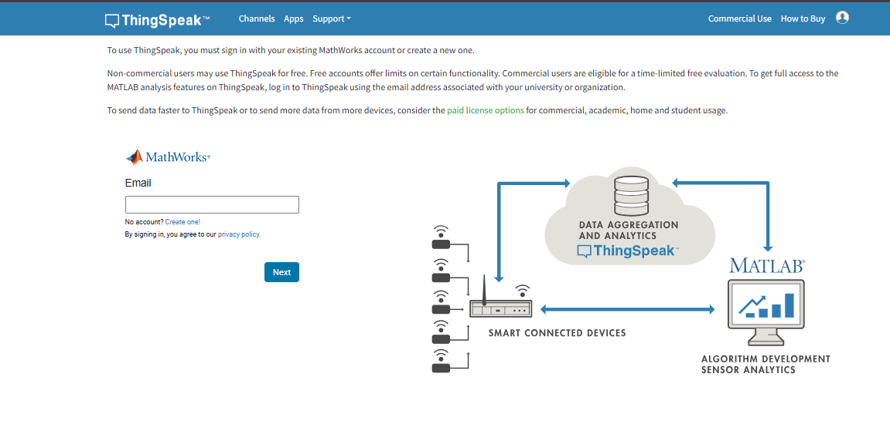
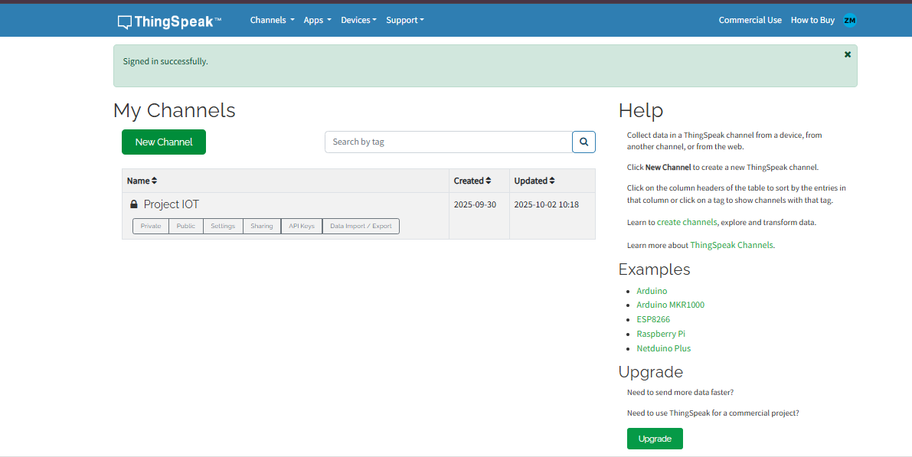
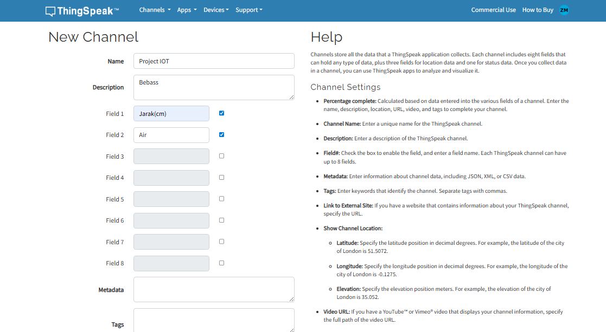
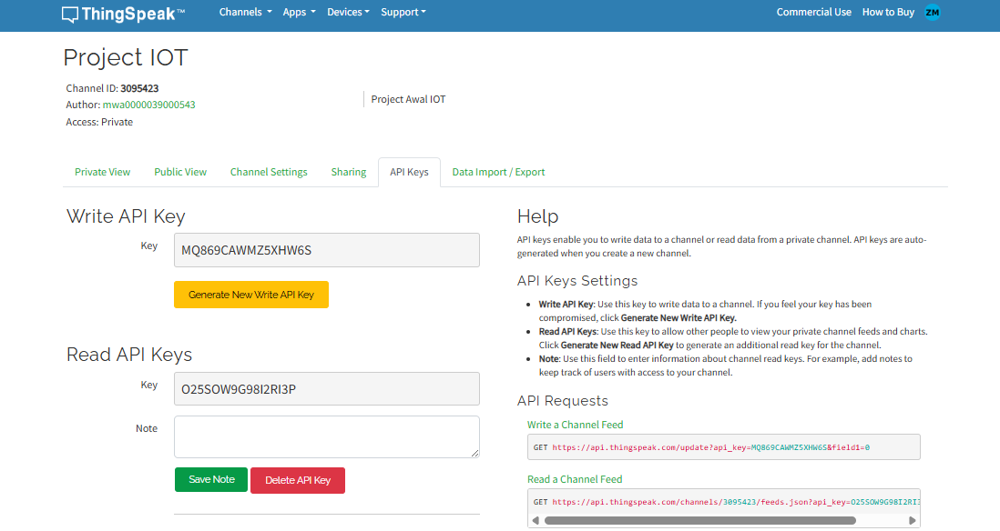
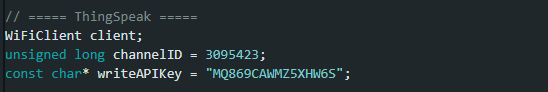
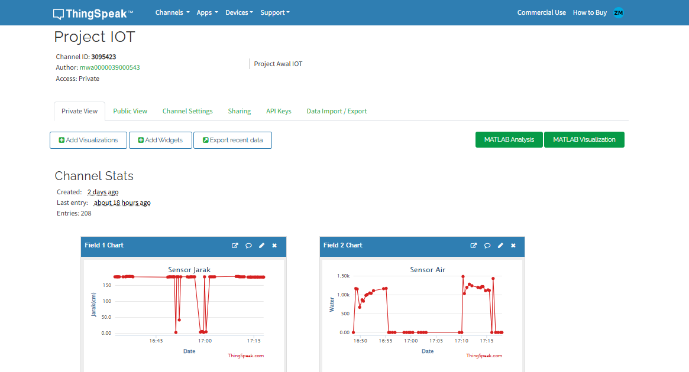

# Laporan Project IOT-B

| Nama           | NRP        |
|----------------|------------|
| Zaenal Mustofa | 5027241018 |
| Muhammad Khosyi Syehab   | 5027241089 |

## Deskripsi Program
Program ini dibuat menggunakan ESP32 dengan tujuan membaca sensor jarak ultrasonik (HC-SR04) dan sensor air analog, kemudian menampilkan hasilnya pada OLED SSD1306, serta mengirim data secara periodik ke ThingSpeak untuk pemantauan jarak dan kondisi air secara online.

## Fitur Utama
1. Pembacaan Jarak
   - ESP32 mengirim pulsa ke pin TRIG, lalu menghitung lama pantulan pada pin ECHO.
   - Hasil pengukuran dikonversi menjadi satuan centimeter (cm).
   - Jarak digunakan untuk menyalakan LED dan buzzer sebagai indikator peringatan.
     - Jika jarak ≤ 10 cm → OLED menampilkan pesan “AWAS! Pak Hatma”, LED menyala, dan buzzer aktif.
     - Jika jarak > 10 cm → OLED menampilkan pesan “Halo Pak Hatma”, LED mati, dan buzzer non-aktif.
2. Pembacaan Sensor Air (Analog)
   - Sensor air terhubung ke pin ADC (GPIO 34) ESP32.
   - Nilai tegangan analog dibaca dengan fungsi `analogRead()`.
   - Untuk mengurangi noise, pembacaan dilakukan beberapa kali dan diambil nilai rata-rata.
3. Tampilan OLED (SSD1306)
   - OLED digunakan untuk menampilkan pesan interaktif berdasarkan kondisi jarak.
   - Tulisan ditampilkan dengan font besar agar mudah terbaca.
4. Indikator LED & Buzzer
   - LED (GPIO 2) dan buzzer (GPIO 4) digunakan sebagai indikator jarak.
   - Memberikan peringatan secara visual (LED) dan suara (buzzer) ketika objek terlalu dekat.
5. Koneksi WiFi & ThingSpeak
   - ESP32 terkoneksi ke jaringan WiFi yang telah ditentukan (`ssid` dan `password`).
   - Data sensor (jarak dan air) dikirim ke ThingSpeak channel dengan interval 15 detik sekali.
   - Field 1 digunakan untuk menyimpan data jarak, sedangkan Field 2 digunakan untuk data sensor air.
6. Manajemen Waktu (millis)
   - Program tidak menggunakan delay() secara penuh, tetapi memanfaatkan millis() agar pembacaan sensor (setiap 1 detik) dan pengiriman data ke ThingSpeak (setiap 15 detik) berjalan non-blocking dan tidak saling mengganggu.

## Alat dan Bahan
1. Board ESP32
2. Lampu LED
3. Sensor Ultrasonic
4. Rain Water Sensor
5. OLED Display
6. Buzzer
7. Kabel Jumper
8. Laptop
9. Kabel USB Data

## Alur Kerja Program
1. ESP32 inisialisasi WiFi, OLED, sensor, dan pin output.
2. Setiap 1 detik, ESP32 membaca:
   - Jarak dari sensor ultrasonik.
   - Nilai sensor air (rata-rata dari beberapa pembacaan).
   - Menampilkan informasi pada OLED dan mengatur kondisi LED/buzzer.
3. Setiap 15 detik, ESP32 mengirim data jarak dan air ke server ThingSpeak.
4. Data dapat dipantau secara real-time melalui grafik ThingSpeak.

## Dokumentasi

### Gambar Project IOT

### Instalasi ThingSpeak
1. Buka ThingSpeak di Web Browser
2. Buat akun atau Login menggunakan Email
   
3. Setelah masuk ThingSpeak, klik New Channel
   
4. Isi form project yang sesuai dengan yang dibuat dan Save Channel
   
5. Buka menu API Keys dan catat ID Channel dan Write API Key nya
   
6. Masukkan API Key pada code program
    
7. Tampialn akhir setelah berhasil terhubung ke ThingSpeak
   
